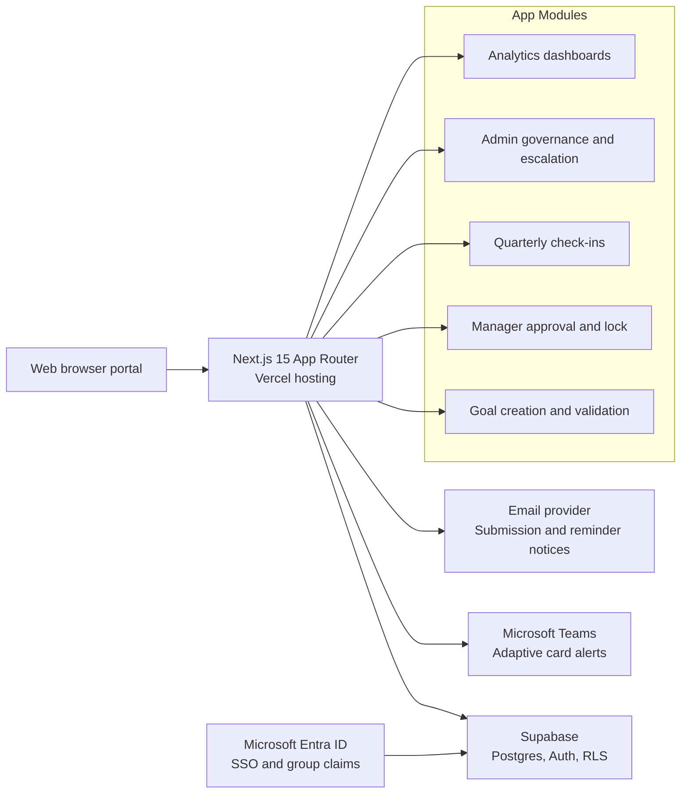

# AlignHQ Architecture

## Hosting Model

- **Frontend and server routes:** Next.js App Router.
- **Database:** Supabase Postgres.
- **Auth:** Supabase Auth with seeded credentials and Microsoft Entra ID SSO entry point.
- **Authorization:** RLS policies over employee, manager, and Admin / HR scopes.
- **Notifications:** Integration-ready email and Microsoft Teams adaptive-card payloads.
- **Escalations:** Rule-based engine for late submissions, late approvals, and missed check-ins.
