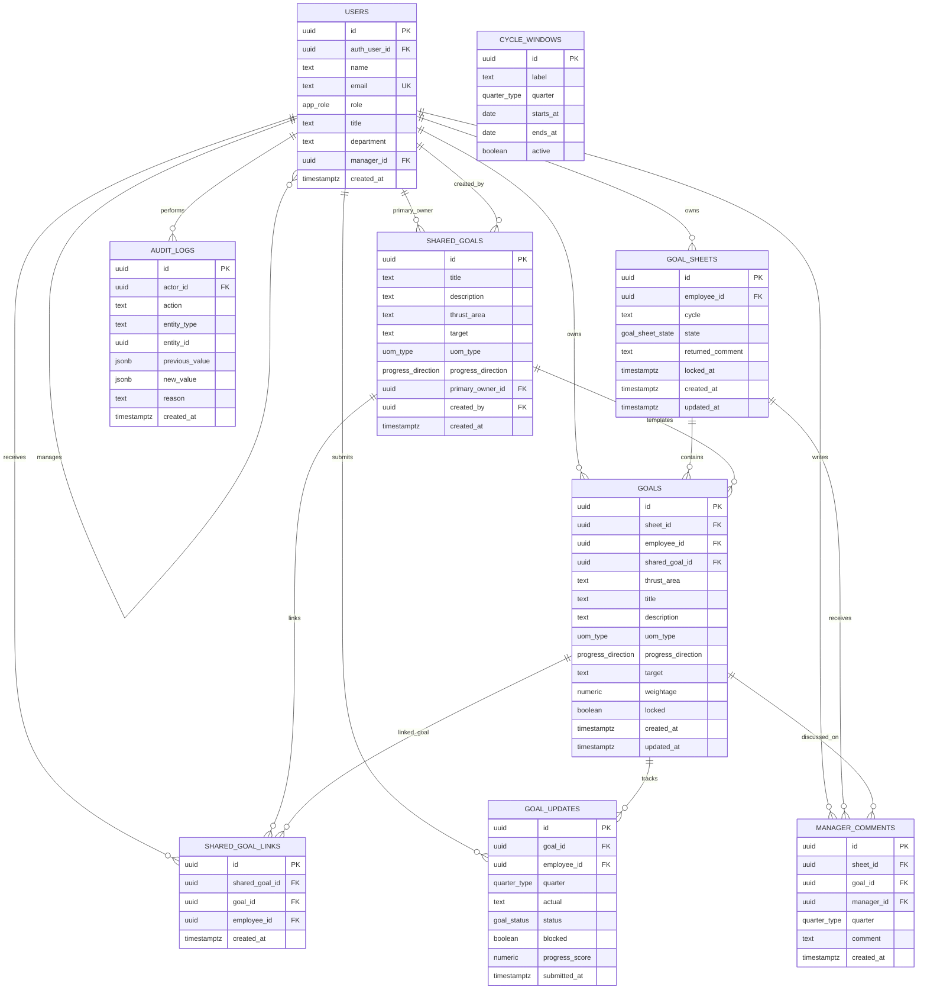

# Supabase Schema Graph

This graph mirrors `supabase/schema.sql` and shows the core AlignHQ data model: users own goal sheets, sheets contain goals, quarterly updates and manager comments attach to goals, and shared KPI records link goals across employees.

## Workflow Reading

- `users.manager_id` forms the manager direct-report tree used by RLS scope checks.
- `goal_sheets` are unique per employee and cycle, and state transitions drive submission, approval, locking, and unlock workflows.
- `goals` are the editable KPI rows under a sheet; locking a sheet locks the related goals.
- `shared_goals` and `shared_goal_links` model manager-created KPIs that can cascade to multiple employees while preserving individual weightage.
- `goal_updates` store one quarterly update per goal and quarter.
- `manager_comments`, `cycle_windows`, and `audit_logs` support check-in review, governance windows, and traceability.
